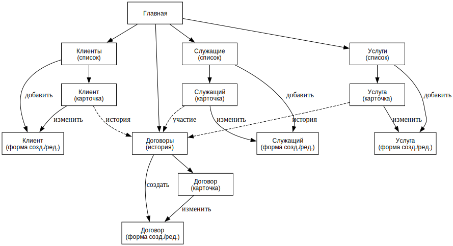

# Клиентская база юридической фирмы — этап 1

## Описание страниц

На каждой странице есть боковое меню со ссылками на основные страницы: **Главная**, **Клиенты**, **Служащие**, **Услуги**, **Договоры**.

- **Главная**
  - Короткое описание системы и доступных разделов.

- **Клиенты (список/поиск)**
  - Таблица клиентов:
    - `id`
    - тип клиента (физ. лицо / организация)
    - наименование / ФИО
  - Фильтры:
    - по `id`
    - по типу клиента
    - текстовый поиск по наименованию/ФИО и по контактным лицам
    - по истории услуг: интервал времени + (опционально) конкретная услуга и/или служащий, участвовавший в оказании
  - Переходы/операции:
    - переход из строки списка в карточку клиента
    - кнопка **Добавить клиента** (создание)

- **Клиент (карточка)**
  - Отображается:
    - основные данные клиента (тип, наименование/ФИО)
    - контактные лица и их контактная информация (телефоны / email / адреса)
    - история услуг (договоры): услуга, период оказания, статус, служащие
  - Операции:
    - **Редактировать**
    - **Удалить**
    - **Зарегистрировать договор** (создать запись об оказании услуги этому клиенту)

- **Клиент (создание/редактирование)**
  - **Отдельная страница** с формой ввода данных. При создании поля пустые, при редактировании — предзаполнены данными клиента.
  - Поля формы:
    - Тип клиента (выбор из списка: Физ.лицо / Организация)
    - Наименование / ФИО (текстовое поле)
    - Заметка (многострочное текстовое поле)
  - Редактирование контактных лиц (динамический список на этой же форме):
    - Добавление/удаление контактного лица
    - Для каждого лица: ФИО, Роль, Комментарий
    - Контакты лица (телефон/email) — добавление/удаление полей ввода
  - Действия: **Сохранить** (валидация и переход к карточке), **Отмена** (возврат назад).

- **Служащие (список/поиск)**
  - Таблица служащих:
    - `id`
    - ФИО
    - должность
    - образование (кратко)
  - Фильтры:
    - по `id`
    - текстовый поиск по ФИО/должности/образованию
    - по участию в оказании услуг: интервал времени + (опционально) клиент и/или услуга
  - Переходы/операции:
    - переход из строки списка в карточку служащего
    - кнопка **Добавить служащего**

- **Служащий (карточка)**
  - Отображается:
    - ФИО, должность, образование
    - контактная информация (телефоны / email / адрес)
    - история участия в договорах (каким клиентам/по каким услугам/когда)
  - Операции:
    - **Редактировать**
    - **Удалить**

- **Служащий (создание/редактирование)**
  - **Отдельная страница** с формой.
  - Поля формы:
    - ФИО, Должность, Образование, Домашний адрес, Примечание.
  - Контакты служащего: динамический список полей (тип контакта + значение).
  - Действия: **Сохранить**, **Отмена**.

- **Услуги (список)**
  - Справочник услуг (тип/наименование + базовая стоимость).
  - Фильтры:
    - по названию
    - по диапазону стоимости
  - Переходы:
    - переход в карточку услуги
    - кнопка **Добавить услугу**

- **Услуга (карточка)**
  - Отображается: Название, Базовая стоимость.
  - Операции: **Редактировать**, **Удалить**.

- **Услуга (создание/редактирование)**
  - **Отдельная страница** с формой.
  - Поля: Название услуги, Базовая стоимость (число).

- **Договоры / история услуг (список/фильтры)**
  - Таблица договоров:
    - `id` / номер договора
    - клиент
    - услуга
    - период оказания
    - статус (черновик/активен/завершён/отменён)
    - стоимость по договору
  - Фильтры:
    - по клиенту
    - по услуге
    - по служащему (участвовал/не участвовал)
    - по статусу
    - по интервалу времени (пересечение с периодом оказания)
  - Переходы/операции:
    - переход в карточку договора
    - **Зарегистрировать договор** (создание)

- **Договор (карточка)**
  - Отображается:
    - клиент, услуга, даты, статус, стоимость
    - список задействованных служащих и их роли (если указаны)
  - Переходы:
    - ссылки на карточки клиента/услуги/служащих
    - кнопка **Редактировать** (изменение статуса, дат или состава участников)

- **Регистрация договора / Редактирование договора**
  - **Отдельная страница** с формой.
  - Поля формы:
    - Номер договора (генерируется или вводится вручную)
    - Клиент (выбор из справочника клиентов, автодополнение)
    - Услуга (выбор из справочника услуг)
    - Даты: Дата подписания, Дата начала, Дата окончания (опционально)
    - Статус (выбор: Черновик, Активен, Завершен, Отменен)
    - Стоимость (предзаполняется базовой стоимостью услуги, можно изменить)
    - Комментарий
  - Участники (служащие):
    - Динамический список: выбор служащего + текстовое поле "Роль в договоре".

## Сценарии использования

### Получение списка клиентов (в т.ч. по услугам в интервале времени, задействованным служащим и пр.)

Главная → Клиенты → заполнение фильтров (интервал времени / услуга / служащий / текстовый поиск) → получение списка клиентов, удовлетворяющих условиям.

### Получение списка служащих по их участию в оказании услуг заданным клиентам и в заданное время

Главная → Служащие → заполнение фильтров (клиент / интервал времени / услуга) → получение списка служащих.

### Регистрация договора об оказании услуги

Главная → Договоры → Зарегистрировать договор → заполнение полей (клиент, услуга, период, стоимость, список служащих) → сохранение → карточка договора.

### Добавление/удаление клиента, чтение и редактирование данных о клиенте

Главная → Клиенты → (Добавить клиента → заполнение формы → сохранение) **или** (поиск клиента → карточка клиента → Редактировать/Удалить).

### Добавление/удаление служащего, чтение и редактирование данных о нем

Главная → Служащие → (Добавить служащего → заполнение формы → сохранение) **или** (поиск служащего → карточка служащего → Редактировать/Удалить).

## Схема навигации

Схема переходов между страницами приведена на диаграмме интерфейса: `ui.svg`.

## Схема базы данных

БД проектируется под PostgreSQL (используемые типы и синтаксис — Postgres-совместимые).

Основные таблицы и поля:

- **`clients`** — клиенты (физические лица и организации).
  - `client_id` — первичный ключ
  - `client_type` — перечислимый тип клиента (`INDIVIDUAL` / `ORGANIZATION`)
  - `display_name` — наименование организации или ФИО физлица
  - `created_at` — время добавления записи
  - `note` — произвольная заметка

- **`client_contacts`** — контактные лица клиента (может быть несколько на клиента).
  - `contact_id` — первичный ключ
  - `client_id` — внешний ключ на `clients`
  - `full_name` — ФИО контактного лица
  - `role` — роль/должность контактного лица (например “главный бухгалтер”)
  - `comment` — примечание

- **`client_contact_methods`** — контактные данные контактного лица.
  - `method_id` — первичный ключ
  - `contact_id` — внешний ключ на `client_contacts`
  - `method_type` — перечислимый тип контакта (`PHONE`, `EMAIL`, `ADDRESS`)
  - `value` — значение контакта (телефон, email или адрес)
  - `is_primary` — признак предпочтительного контакта

- **`employees`** — служащие (сотрудники юридической фирмы).
  - `employee_id` — первичный ключ
  - `full_name` — ФИО
  - `position` — должность
  - `education` — образование
  - `home_address` — домашний адрес
  - `note` — примечание

- **`employee_contact_methods`** — телефоны/e-mail/адреса служащих.
  - `method_id` — первичный ключ
  - `employee_id` — внешний ключ на `employees`
  - `method_type` — тип контакта (`PHONE`, `EMAIL`, `ADDRESS`)
  - `value` — значение контакта
  - `is_primary` — признак предпочтительного контакта

- **`services`** — справочник услуг.
  - `service_id` — первичный ключ
  - `name` — наименование услуги (например “Банкротство”, “Консультации”)
  - `base_cost` — базовая стоимость

- **`service_contracts`** — договоры об оказании услуг (основа “истории услуг”): кто, какую услугу, когда и за какую стоимость оказывал.
  - `contract_id` — первичный ключ
  - `contract_number` — номер договора (уникален)
  - `client_id` — внешний ключ на `clients`
  - `service_id` — внешний ключ на `services`
  - `signed_on` — дата подписания договора
  - `service_start`, `service_end` — период оказания услуги (конец может быть `NULL` для текущих договоров)
  - `status` — перечислимый статус (`DRAFT`, `ACTIVE`, `COMPLETED`, `CANCELLED`)
  - `agreed_cost` — стоимость по конкретному договору (может отличаться от `services.base_cost`)
  - `comment` — примечание

- **`contract_employees`** — связь многие-ко-многим “договор ↔ служащий” (кто был задействован).
  - `contract_id` — внешний ключ на `service_contracts`
  - `employee_id` — внешний ключ на `employees`
  - `role` — роль в договоре (например “ведущий юрист”)
  - первичный ключ составной: (`contract_id`, `employee_id`)

Связи:

- `clients (1) → (N) client_contacts (1) → (N) client_contact_methods`
- `employees (1) → (N) employee_contact_methods`
- `clients (1) → (N) service_contracts (N) ← (1) services`
- `service_contracts (N) ← (N) employees` через `contract_employees`

## Отображение данных БД на страницы интерфейса

- **Клиенты (список/поиск)**: `clients` + (для поиска по контактам) `client_contacts`, `client_contact_methods`; фильтры по истории услуг — `service_contracts` + `contract_employees`.
- **Клиент (карточка)**: `clients`, `client_contacts`, `client_contact_methods`; история услуг клиента — `service_contracts` + справочник `services` + участники из `contract_employees`/`employees`.
- **Служащие (список/поиск)**: `employees` + (для поиска по контактам) `employee_contact_methods`; фильтры по участию — `contract_employees` + `service_contracts`.
- **Служащий (карточка)**: `employees`, `employee_contact_methods`; участие в договорах — `contract_employees` + `service_contracts` + `clients` + `services`.
- **Услуги (справочник)**: `services`.
- **Договоры / история услуг**: `service_contracts` + `clients` + `services`; фильтр по служащим — `contract_employees`.
- **Регистрация договора**: создание `service_contracts` и списка участников в `contract_employees` (выбор клиента из `clients`, услуги из `services`, служащих из `employees`).

## Файлы этапа 1

- `create.sql` — создание схемы БД
- `init.sql` — примерное заполнение БД (в каждой таблице ≥ 3–5 записей; для enum-типов присутствуют записи со всеми значениями)
- `build.xml` — Ant-задачи: создание, инициализация, вывод содержимого, очистка

## Этап 2 (Hibernate + DAO + TestNG)

Реализованы:

- Классы хранимых объектов (Hibernate/JPA) для всех таблиц схемы:
  - `Client`, `ClientContact`, `ClientContactMethod`
  - `Employee`, `EmployeeContactMethod`
  - `ServiceEntity`, `ServiceContract`, `ContractEmployee`
  - enum-типы: `ClientType`, `ContactMethodType`, `ContractStatus`
- Конфигурация Hibernate:
  - `src/main/resources/hibernate.cfg.xml` — рабочая конфигурация под PostgreSQL
  - `src/test/resources/hibernate-test.cfg.xml` — тестовая конфигурация под H2
- DAO-классы с CRUD и типовыми запросами приложения:
  - `ClientDao`
  - `EmployeeDao`
  - `ServiceDao`
  - `ServiceContractDao`
- Модульные тесты TestNG для всех DAO-методов с нетривиальной логикой:
  - `ClientDaoTests`
  - `EmployeeDaoTests`
  - `ServiceDaoTests`
  - `ServiceContractDaoTests`

### Сборка и запуск тестов

Используется `Ant` + `Ivy`.

- `ant resolve` — скачать зависимости в `lib/`
- `ant compile` — сборка основного кода
- `ant compile-tests` — сборка тестов
- `ant test` — запуск TestNG тестов

### Ant-задачи для БД

В корневом `build.xml` добавлены прокси-задачи к SQL-этапу:

- `ant db.create`
- `ant db.init`
- `ant db.reset`

